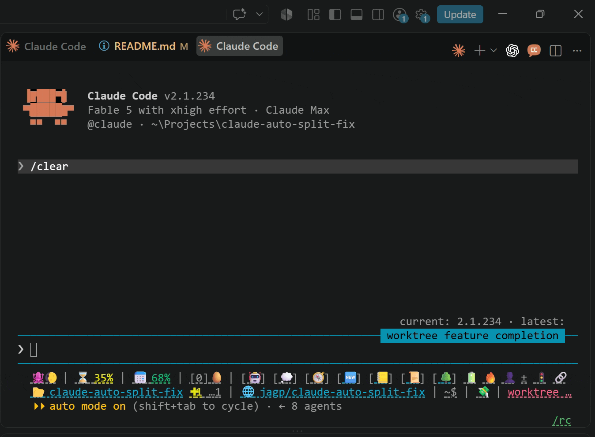

# Claude Code — Fix for New-Tab Auto-Splitting

This extension watches for new Claude tabs (which currently open in new Editor groups), immediately shifting them into your previously active editor group. As seen here:



## Purpose

Claude's VS Code toolbar button has a weirdly opinionated behavior: it splits your active editor group into a new, _locked_ group, and puts the new conversation tab in it.

Standard UX would place the new tab as a sibling of your current tab,in the same group. The recent designation of "closed-as-unplanned" suggests this won't change any time soon.

Hence, this set-it-and-forget-it extension to simply fix that odd behavior. It moves the freshly created tab back into your active group automatically; the superfluous editor group then dies automatically.

## Notes

### Mechanics

It also catches the sibling annoyance ([anthropics/claude-code#33884](https://github.com/anthropics/claude-code/issues/33884)): with Claude Code docked in the sidebar, clicking a file link — a `Read` tool result, say — opens that file in a brand-new editor group instead of the one you were working in. A file that opens alone in a fresh group gets moved back too, unless the same document is already visible in another group, since that layout is what a deliberate split-to-the-side looks like. This half is controlled by `claudeAutoSplitFix.moveFileTabs`.

### Kill Switch

A few plausible scenarios exist in which you'd want the above detection disabled (if you often spawn blank tabs into new editor group) try toggling `claudeAutoSplitFix.moveFileTabs`.

## How to Use

2 supported install paths:

### Download & Install

1. Grab the most recent version from github in the Releases section.
2. Point your VSCode at the VSIX.
3. Reload

### Build & Install

Build the VSIX:

```sh
npm install
npm run package        # writes dist/claude-auto-split-fix-<version>.vsix
```

In VS Code:

- `Ctrl+Shift+P` to open Command Palette
- Select **Extensions: Install from VSIX...**
- pick the VSIX file (in `dist/` after a build)
- Reload

## Settings

| Setting                             | Default | Purpose                                                                                                                                                                                                                                               |
| ----------------------------------- | ------- | ----------------------------------------------------------------------------------------------------------------------------------------------------------------------------------------------------------------------------------------------------- |
| `claudeAutoSplitFix.enabled`        | `true`  | Turn the correction on or off.                                                                                                                                                                                                                        |
| `claudeAutoSplitFix.moveFileTabs`   | `true`  | Also move a file that opens alone in a brand-new group (the sidebar file-link case) back into the previous group. Turn off if you deliberately open not-yet-open files into new splits — the tab API cannot tell those apart from a Claude file link. |
| `claudeAutoSplitFix.restoreDelayMs` | `400`   | How long to wait before correcting. Claude stamps its identity on the tab a few hundred ms after opening it, so this cannot be too small.                                                                                                             |
| `claudeAutoSplitFix.diagnostics`    | `true`  | Log tab and group events to the "Claude Auto-Split Fix" output channel.                                                                                                                                                                               |

## Troubleshooting

If the tab is not being moved, run **Claude Auto-Split Fix: Show Diagnostic
Output** from the Command Palette. The channel records every group and tab
event, why a candidate was skipped, and whether the correction ran.

Known limits of the file-link correction, all deliberate do-no-harm choices:
a link to a file already open in another group is left alone (that layout also
describes your own splits); for about 2.5 seconds after any new split appears
— yours or a pending correction's — further corrections stand down rather than
risk moving a file into the wrong group, so the second of two rapid link
clicks keeps its split; and a link clicked within about a second of closing a
tab on the same file reads as a drag and is left alone.

## Layout

| Path           | Contents                                                                                                                                                        |
| -------------- | --------------------------------------------------------------------------------------------------------------------------------------------------------------- |
| `package.json` | Extension manifest.                                                                                                                                             |
| `extension.js` | The entire implementation.                                                                                                                                      |
| `icon.png`     | 128×128 icon that ships in the VSIX.                                                                                                                            |
| `test/`        | `npm test`: node-only harness against a mocked VS Code API. `npm run test:vscode`: integration checks in a real, briefly visible VS Code window. Neither ships. |
| `dist/`        | Current build output.                                                                                                                                           |

## Scope

A workaround for current Claude Code extension behavior. If Anthropic adds
native support for opening a new conversation in the active editor group,
disable or uninstall this extension.

## License

Unofficial. Not affiliated with Anthropic.

MIT
